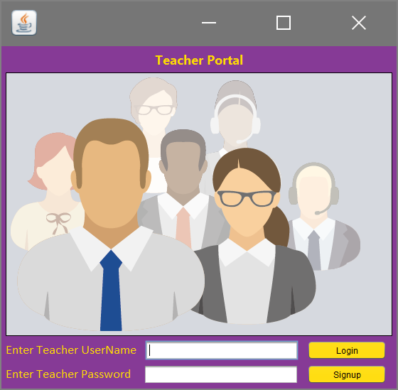
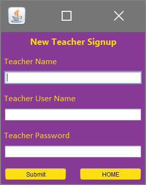
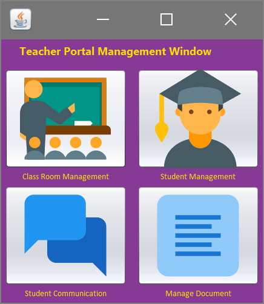
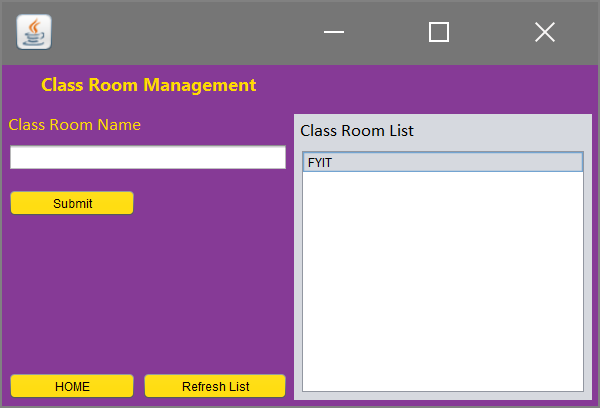
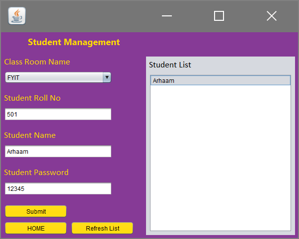
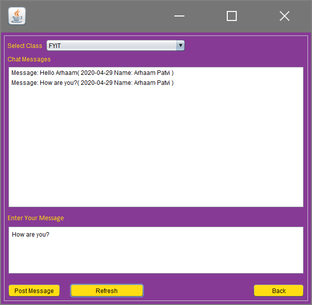
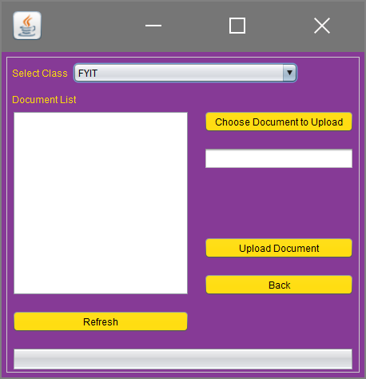

# MyClassroom
Java application for student-teacher communication that enables a teacher to manage students, manage study material and communicate with the students. 

  &nbsp;&nbsp;&nbsp;&nbsp;&nbsp;&nbsp;

---
**TEACHER PORTAL**
 
<table>
  <!--ROW 1-->
  <tr>  
    <td>1)Login</td>
    <td>2)Signup</td>
    <td>3)Main</td>
  </tr>
  <tr>
    <td></td>
    <td></td>
    <td></td>
  </tr>
  <!--ROW 2-->
  <tr>  
    <td>4)Class Management</td>
    <td>5)Student Management</td>
    <td>6)Communication</td>
  </tr>
  <tr>
    <td></td>
    <td></td>
    <td></td>
  </tr>
  <!--ROW 3-->
  <tr>  
    <td>7)File Upload</td>
  </tr>
  <tr> 
    <td></td>
  </tr>
</table>
